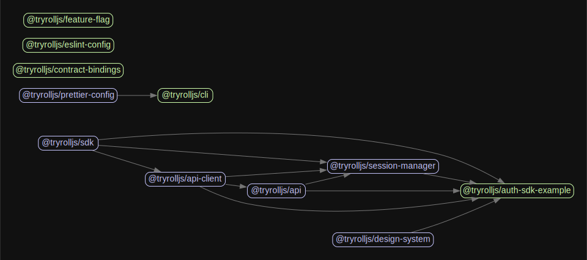

# @tryrolljs/root

This repo is an entrypoint for all Roll monorepo packages.

## Packages

- [@tryrolljs/cli](./packages/cli)
- [@tryrolljs/eslint-config](./packages/eslint-config)
- [@tryrolljs/prettier-config](./packages/prettier-config)
- [@tryrolljs/design-system](./packages/design-system)
- [@tryrolljs/feature-flag](./packages/feature-flag)
- [@tryrolljs/contract-bindings](./packages/contract-bindings)
- [@tryrolljs/api](./packages/api)
- [@tryrolljs/api-client](./packages/api-client)
- [@tryrolljs/auth-sdk](./packages/auth-sdk)
- [@tryrolljs/session-manager](./packages/session-manager)

### Private packages

There are some packages that are not listed above (ex. [@tryrolljs/example-web-oauth-client](./examples/example-web-oauth-client)). These packages should always start with the `example-` prefix & be responsible for showing how a package/set of packages should be used by a consumer.

### Dependants graph

## Release

1. Update the code.
2. Run `yarn changeset` to pick the changed packages & the grade of your update (patch, minor or major).
3. Create a PR with the generated changeset file.
4. Merge the PR.
5. Wait until a `Version Packages` PR is created.
6. Check that the auto-generated PR's changes are correct (version updates, CHANGELOG updates).
   1. If it's not correct, update manually.
7. Merge the PR.
